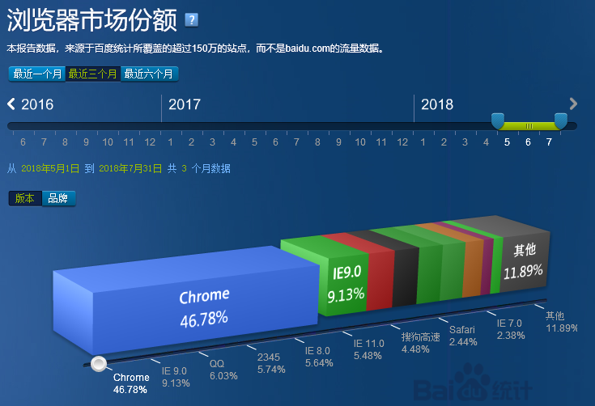
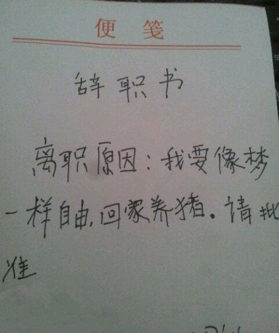
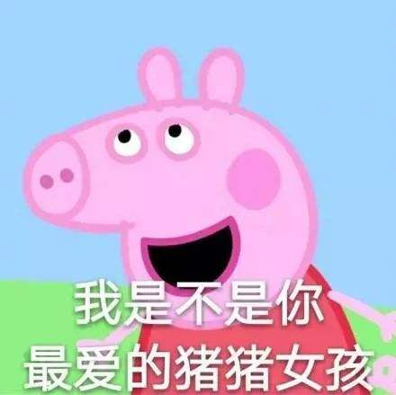
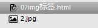
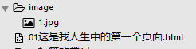
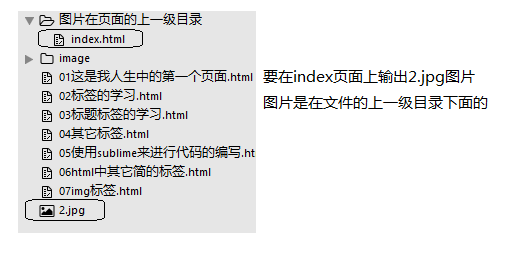

# 学习目标

> 能说出常用的五大浏览器
>
> 能说出WEB的三大组成部分
>
> 能够写出HTML的基本结构（骨架：html、head、title、body ）
>
> 能够说出常见的单标签（hr、br、img）
>
> 能够写出4~5个常见的双标签（h系列6个、p标签、文本格式化标签8个、骨架的几个标签）
>
> 能够写出图片标签的使用及属性
>
> 能够说出相对路径的三种形式（同级目录、下级目录、上级目录）
>
> 。。。。。。


**理解上课的知识点**......


# 课前了解

1. 课程安排

   > html : 3天 
   >
   > css : 6天 
   >
   > 项目 : 5天

   特点 :  [ 慢、 细、 易 ]   

   目的：把基础打牢

   - 好的不骄傲
   - 不好的不气馁

   

2. 打字速度

   > 打字速度是程序员的基本技能

   - 严禁 `二指禅` :  必须养成正确的指法  ( 没有正确的指法，在机试中只能告辞 )   

   - 打字速度，越快越好  120单词/min

     

3. 安装词典 

   > 帮助学习记忆代码

   - 随时使用词典, 不会的单词就查出来

   

4. 开发习惯设置  

   > 便于之后的开发

   - 将文件后缀名显示出来  (**必做**) 
   - 将文件的排列方式改为详细信息，并且名称一定要能够全部显示出来 
   - 将常用的工具软件锁定到任务栏 

   

5. win快键键

   > 快捷键可以提高我们的开发效率

   - Ctrl + C：复制
   - Ctrl + V：粘贴
   - Ctrl + X：剪切
   - Ctrl + S：保存
   - Ctrl + N：新建
   - Ctrl + A：全选
   - Ctrl + Z：撤销上一个操作
   - win + E：打开资源管理器
   - Alt + tab：切换程序（注意Alt键不松手）
   - Win + D：切换到桌面
   - Win + R：快速运行（打开软件） 
     - cmd：命令行           
     - calc：运行计算器
     - mspaint：运行画图工具

   

6. 学习要求    

   > 对于学习的一些要求

   - 课堂互动：防走神，防瞌睡

   - 课后代码：老师上课的代码至少敲3遍（重要的是通过上课的代码理解知识点！！），之后再做作业，然后还有余力的同学预习第二天的笔记（会与熟练两码事）。

   - 学习模式：

     - 精力放在重点，了解内容记住即可（不要钻牛角尖）
     - HTML和CSS比较灵活（不易报错），按照**规范**敲正确的代码

     

# 认识网页（了解）

> 你觉得前端是做什么的？

```js
问题1 : 网页由哪些基本元素构成 ? （文字、图片、超链接、视频、音频等等） 

问题2 : 那我们看到的网页 , 光鲜的背后又是什么呢? （代码组合）  

问题3 : 浏览器的作用? （将代码解析成网页,供用户访问） 
```

**少了浏览器可以吗？**

> 浏览器将代码解析成网页，供用户访问 ! 用户不会去看代码，所以浏览器很必要！


# 五大浏览器介绍（记忆）

> 浏览器是网页运行的平台。


**五大浏览器：**

- IE（Edge）浏览器
- Firefox（火狐）浏览器
- Chrome（谷歌）浏览器
- Safari浏览器
- Opera（欧朋）浏览器

## 各浏览器的市场份额

**查看网站：** <a href="http://tongji.baidu.com/data/browser" target="_blank">http://tongji.baidu.com/data/browser</a>



**谷歌浏览器：**访问速度快、用户体验好、开发调试功能齐全，之后的学习过程中，统一使用谷歌


## 浏览器内核

> 浏览器的内核（渲染引擎：render 渲染  engine 引擎）相当于汽车的发动机，是最核心的存在。

**作用**：将网页代码解析（转换）并渲染（显示）成用户眼中的界面

**内核的种类：**

- **Trident**（IE、猎豹安全浏览器、360极速浏览器）

> Edge新内核 EdgeHTML

- **Gecko**（Firefox） 

> 代码开源，但是打不过Chrome

- **Webkit**（Safari、傲游浏览器3、Symbian手机浏览器、Android 默认浏览器）
- **Blink（Webkit的升级版）**（Chrome, Opera）

**总结：**

- IE浏览器（Trident）
- Firefox（火狐）浏览器（Gecko）
- Chrome（谷歌）浏览器（blink）
- Safari浏览器（webkit）
- Opera（欧朋）浏览器（blink  早期：presto ）


**浏览器内核不同有什么影响？**

> 浏览器的内核不同，我们知道他们工作原理肯定不同，显示就会有差别, 需要一个标准来统一......


# Web标准（记忆）

## 为什么会有web标准

> 同样的代码，需要在不同浏览器显示效果相同。


## Web 标准构成

> 将页面分为三层：结构、样式、行为。

- **结构：**HTML------页面骨架
- **样式：**CSS------页面样式
- **行为：**JS（JavaScript）------页面动态效果

### 图解Web标准

> 把一个页面看成一个人

**结构标准：**决定是否有一个好的身体。


**样式标准：**决定是否化妆的美丽漂亮。


**行为标准：**决定是否有吸引人的行为。


# HTML初识（了解）

## HTML的概念

**概念**：HTML（英文Hyper Text Markup Language的缩写）中文译为“超文本标记语言”，主要是通过HTML标签对网页中的文本、图片、声音等内容进行描述。

##### ヾ(๑╹◡╹)ﾉ"变粗案例

说白了HTML就是用尖括号包裹起来的英文单词，浏览器对这个尖括号包裹起来的英文单词有特殊的解释（会让文字有特殊的效果）

```
如：<strong>加粗</strong>  <h1>大标题</h1>  等等
```


## HTML骨架结构 

> 写网页类似于写文章，文章有对应的格式，HTML也有规定的格式。




HTML的固定格式：

```html
<html>
    <head>
        <title>页面的标题</title>
    </head>
    <body>
        写自己的代码
    </body>
</html>

为了便于阅读：包含关系的标签使用用缩进
```

 记忆：猪猪女孩记忆法




##### ヾ(๑╹◡╹)ﾉ"书写我们的第一个HTML页面

1. 新建一个demo 的.txt文件
2. 里面写入刚才的HTML骨架
3. 把后缀名改为 .HTML
4. 右击 —》谷歌浏览器打开

**注意：**结构不会在我们的页面上显示，但是却会让我们的代码结构更加清晰明确


# 开发工具的基本使用（操作）


## 基础班使用sublime

### 使用 sublime 新建页面的过程

1. 打开sublime，`ctrl + n` 新建一个文件；
2. ctrl+S 保存，命名: " 创建的文件**.html** " （**后缀名必加！**）

##### ヾ(๑╹◡╹)ﾉ"用sublime写一个页面骨架

### sublime 快捷键

- 新建文件: `ctrl + n`

- 保存文件 : `ctrl + S `

- 快速生成一个标签：英文+tab

- 打开文件夹：文件夹直接拖进来 / 文件 =>打开文件夹

- 显示侧边菜单: `ctrl + k + b`  （按照 ctrl 不要松,再先后点击 k 、b）

- 生成结构代码: `html:5 + tab` 或者 `! + tab`   (前提：必须是后缀.html文件)

  > <!DOCTYPE>：文档DTD 作用是告诉浏览器我们当前用的是什么html的版本（明天会说）

- 快速复制一整行 `ctrl + shift + d`

- 删除一行： `Ctrl+X`

- 注释 : ctrl + / 

  > 注释：在代码中展示，页面渲染时会忽略，用户看不到，给程序员看。`<!-- 需要注释的内容-->`

  

##### ヾ(๑╹◡╹)ﾉ"偷偷夸老师

 

# HTML的其他介绍（了解）

## 标签的关系

> 嵌套关系（父子关系）

```html
<head>  
    <title></title>  
</head>
```


> 并列关系（兄弟关系）

```html
<head></head>
<body></body>
```


##### ヾ(๑╹◡╹)ﾉ"测试题

```html
请问下列哪个标签是错误的？（提高阅读性：父子关系缩进一个tab）
A ：
<head></head>
<body></body>

B：
<div>
    <p></p>
</div>

C：
<head><title></head></title>

D：
<body><div></div></body>
```


## HTML的标签分类

```html
双标签：如<strong>标签的内容</strong>  
	   语法：<开始标签> 标签内容 </结束标签>
	   <strong>我要变粗</strong> <head></head>......
单标签：<br/>单标签都是功能性的标签，例如换行等功能里面不需要添加内容 
	   语法：<标签名 />
	   <br> <hr>  ......
```

# HTML中的标签（熟练）

> 用<>包裹的英文单词

## h 系列的标签 (Header) : 标题标签

h1，h2，h3，h4，h5，h6

**作用** : 给页面上的文字加上标题的语义

**代码** : `<h1>我就是h1标签</h1>`

**效果** :  h1，h2，h3，h4，h5，h6 将文字放大、加粗、并且逐渐变小（h1标签是最大的）

**特点** : 独占一行

**注意** :  h1 标签尽量少用，太多不利于SEO(搜索引擎优化) 。 一般h1 都是给文章的标题或者 logo使用。


## p 标签 (Paragraph) : 段落标签

**作用**:   给页面上的一段文字加上段落的语义

**代码**:  `<p>这是段落</p>`

**特点**：页面上的一个段落，单独占一行，并且与上下内容之间存在距离。

##### ヾ(๑╹◡╹)ﾉ"在新浪网页上查看元素


## hr 标签 (Horizontal Rule)：水平线标签

**作用**: 在页面上显示一条`横线`

**代码**: `<hr />`


##### ヾ(๑╹◡╹)ﾉ"可以写一个新闻页面了

 


## br 标签 (break row=行)：换行标签

**作用**：强制换行（代码中换行无效）

**代码**：`<br />`


## (4组)文本格式化标签   

> b u i s , strong ins em del

**作用**:

- b: 加粗
- u: 下划线
- i: 倾斜
- s: 删除线

**建议不要使用,  因为这些标签没有语义**

**作用**: 

- strong: 加粗
- ins: 下划线
- em: 倾斜
- del: 删除线

**可以使用**

**语义: 起强调加强语气作用**


# 标签的属性（了解）

> 属性为 HTML 元素提供附加信息。（让同一种标签有不同的显示效果）


比如：

```html
<hr color="red" width="400" />

```

格式：

```html
<标签名 属性名1="属性值1" 属性名2="属性值2" …> 内容 </标签名>
```

注意：

- 标签可以同时有多个属性，并且属性之间以空格隔开（可读性、规范）
- 标签名与属性名之间，必须以空格隔开！
- 属性与属性之间没有顺序关系！ 
- 每个标签上的属性并不是完全相同

提倡：尽量不使用样式属性。


# 图片标签（重点）

## img 标签 (image的简写) ：图片标签

**作用：**  在页面中显示一张图片

**代码：** ``

**特点：** 就是显示图片

**属性：** 

- src：图片显示的路径（**必须**）
- alt：如果图片加载不出来，会显示这个属性中的文字
- title：介绍这张图片
- width：图片的宽度
- height：图片的高度

> 图片宽高只设一个, 另一个会等比例缩放
>
> 两个都设可能会变形，所以一般我们只设一个。


# 路径问题（难点）

> 当前文件找目标文件的过程


### 绝对路径

> 用的较少，可移植性差

带有**盘符**的路径: `C:\Users\ziyue\Desktop\代码\01.jpg`

### 相对路径

> 用的很多，可移植性很好

#### 同级目录

**如果页面与图片同一级目录，直接写目标文件的名字（类比如我们俩都在大厅）**



```

或者

```

#### 下级目录

**下级目录**：如果图片在同级目录image文件夹下



```

```

**步骤：**

1. 找到图片所在的目录（先写文件夹的名字）
2. 去图片所在文件夹里面（文件夹名字/）
3. 然后直接写目标文件的名字即可（文件夹名字/目标文件的文件名）

#### 上级目录

**上级目录**：如果图片在页面的上一级目录



```

```

**步骤：**

1. 首先去目标文件所在的目录。去上一级目录（../）
2. 直接在路径后面写目标文件的名字（../目标文件的名字）

**总结：**

- 通过`文件夹名 /` 可以来到下一级目录，通过` ../` 可以来到上一级目录
- 一般开发中用的最多的是相对路径，**因为相对路径的可移植性要强**。（**我发给你，你能看~**）