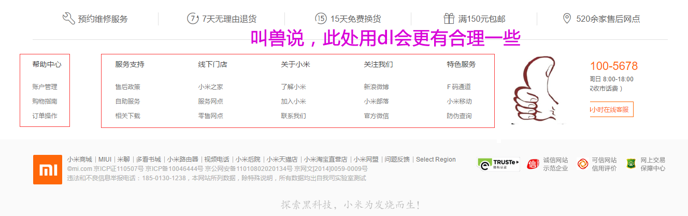
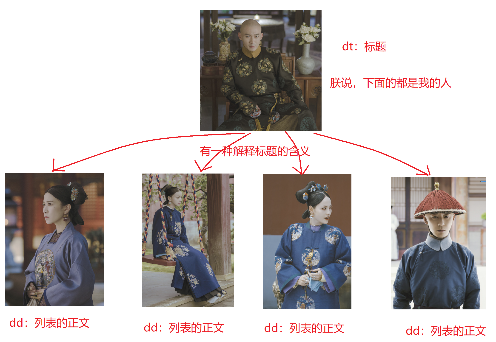

# 学习目标

>能够说出超链接的使用及属性
>
>了解网页编码，能够通过charset设置编码（字典、`<meta charset="UTF-8">`）
>
>了解SEO的作用（用来优化网站，使用网站在搜索引擎上的排名靠前）
>
>什么是标签语义化（在合适的地方使用合适的标签）
>
>能够书写ul/ol/dl三种列表（无序列表、有序列表、自定义列表）
>
>能够写出表格标签及相关属性
>
>能够合并单元格
>
>。。。。。。


**理解上课的知识点**......


# 链接标签（重点）

## a 标签 (Anchor ) : 超链接（锚）

> 超链接在页面中起到跳转或定位的作用（超链接、锚链接、a链接、a标签）

## a标签的跳转功能

**作用:**  可以从一个页面跳转到另一个页面

**代码:**  `<a href="跳转目标" target="目标窗口的弹出方式">文本或图像</a>`

**效果：**

1. 链接未点击的时候，默认显示蓝色
2. 链接点击过以后，显示为紫色（因为浏览器有默认的缓存机制，只要访问过一次的链接，默认都会展示成紫色，只有清除浏览器的缓存，才会变蓝）

**注意：**

1. 在 a 标签之内必须写上内容, 如果没有内容, 页面上会看不到
2. a 标签不能嵌套（如果有两个a标签嵌套，那么点击的时候去哪里呢？）


## a 标签的属性

- **href：**a 标签跳转的目标地址（路径）

  - 外部链接（互联网上）需要添加 `http:// www.baidu.com`
  - 内部链接（文件夹中）直接链接页面的路径即可 比如  `< a href="index.html"> 首页 </a >` 

- **target：**用于指定链接页面的打开方式

  - `_self` ：在当前页面，进行跳转
  - `_blank` :  保留原始页面，再进行跳转

- **相关标签** ：

   base 标签

   **作用：**可以为页面上所有的a标签设置跳转的方式（base标签一般放在titile标签下面）


## a 标签的其他用法

- **可以不跳转** (不写路径其实会刷新页面！刷新也不要哦~)
  - `href="#"`  
  - 项目中没有确定链接目标时，通常将链接标签的href属性值定义为“#”，表示该链接暂时为一个空链接
- **可以进行下载**（一般不用）
  - 当路径指向的目标文件是浏览器打不开的文件时，浏览器会默认下载下来。


## a标签的定位功能

> a标签可以快速定位到当前页面或者其他页面的目标内容（百度百科）

### 在当前页面进行定位

##### ヾ(๑╹◡╹)ﾉ"吸猫大法

**步骤：**

1. 给目标标签加上id属性

   ```html
   <p id="mao">我是一只猫</p>
   ```

2. 给链接的href属性中写上`#目标标签的id属性值`

   ```html
   <a href="#mao">吸猫大法</a>
   ```

### 在跳转的页面进行定位

##### ヾ(๑╹◡╹)ﾉ"跨界吸猫

**步骤：**

1. 给目标文件中的目标标签加上id属性

   ```html
   <p id="mao">我是一只猫</p>
   ```

2. 给当前文件的链接的href属性中写上 `目标文件路径#目标标签的id属性值`

   ```html
   <a href="目标文件路径#mao">吸猫大法</a>
   ```


# 结构中每个标签的含义（了解）

## DOCTYPE : 文档类型

**作用：** 用来定义文档类型（告诉浏览器，使用哪种规范去解析html页面）

**位置：**文档的最前面的位置

**规范：**HTML 或 XHTML 规范

**html:xt  ：**XHTML规范，已经淘汰了， 一些特别老的网站会有，知道即可

```
<!DOCTYPE html PUBLIC "-//W3C//DTD XHTML 1.0 Transitional//EN" "http://www.w3.org/TR/xhtml1/DTD/xhtml1-transitional.dtd">
```

**html:5    ：**  HTML5规范，非常的简洁

```
<!DOCTYPE html>
```

## html 标签

**作用：**所有html中标签的一个根节点（老祖宗）

**lang：**用来设置当前页面的语言（标签的语言、对比易语言）

```html
<html lang="en">
</html>

en-英文 zh-中文
英文的意思并不是告诉浏览器，我们这就是纯英文的，而且告诉浏览器我们的内容以英文为主，提高浏览器的渲染性能
```

## head 标签

**作用：**用于存放**网页的配置标签**和**引入文件的标签**

```html
title、meta、base、style、script、link

注：在head标签中我们必须要设置的标签是title, 其他可有可无 
```


## body 标签

**作用：**页面在的主体部分，用于存放页面中的html标签

```html
p、h、a、b、u、i、s、em、del、ins、strong、img
```

## meta 标签

**作用：**设置网页的元信息

**注意：**meta中设置的所有的内容在页面都不会显示,  在其中可以设置编码格式、样式、关键字等等

**设置字符集（编码格式）：**

```html
<meta charset="UTF-8">

Charset（字符集的格式）：UTF-8
```

##### ヾ(๑╹◡╹)ﾉ"乱码的原因

 **最常见的3种字符集（字典）：**

- UTF-8：国际化的字典，字体库，收录是全世界所有的语言中的文字

  1汉字 = 3个字节

- GBK：收录了大陆汉字，还加了港澳台的文字-》ANSI（中国）

  1个汉字= 2个字节

- GB2312：收录了大陆汉字

 **约定：**将来我们在整个学习过程中都用utf-8（与国际接轨）

## title 标签

**作用：**让页面拥有一个属于自己的标题。

**注意：**title中的文本在 seo 中占有很大的权重，不能乱写


# SEO与标签语义化（了解）

##### ヾ(๑╹◡╹)ﾉ"title标签与h1标签的权重

## SEO : 搜索引擎优化

> Search Engine Optimization
>
> 写网页的目的-》用户的习惯-》用户的结果-》怎样排名靠前-》seo

**作用**：用来优化网站，使用网站在搜索引擎上的排名靠前

```
百度是如何收录一个网站的信息的呢？

百度自己写的一个程序来收录每个网站的信息。
```

### 怎样提升网站的SEO（记忆）

- **花钱买排名**

  缺点：烧钱。

  优点：效果杠杠的

- **将页面做成静态页面**（html后缀）

- **发外链**（类似于广告）

- **标签语义化（语义化规范）**

  > 在合适的地方使用合适的标签

  标签语义化的应用：每个html标签都有属于自己的语义，有使用标签时候要一定要了解每个标签的语义，合理使用。

## 标签语义化的好处

> 在合适的地方使用合适的标签（比如title和h1）

1. 对搜索引擎的友好，提高网页的SEO（将来网络爬虫进入页面之后可以很方便的得到页面的重要信息）
2. 提升用户体验（css加载不出来也能看出重要性）
3. 利于代码的可读、维护、提高开发效率 (网页源代码方便查询)


# 列表（熟练）

## 无序列表 ul （Unordered List）

> 一列没有顺序的列表（用的最多）

##### ヾ(๑╹◡╹)ﾉ"水果列表

**作用：**显示一列没有排列顺序的数据

**语义：**一组没有顺序的数据

**代码：**

```html
<ul>
  <li>列表项1</li>
  <li>列表项2</li>
  <li>列表项3</li>
  ......
</ul>
```

**注意：**

- 无序列表中的数据没有先后顺序之分
- `<ul></ul>` 中只能嵌套`<li></li>` ，不能放其他标签或者文字
- `<li></li>` 标签中可以嵌套任意标签（嵌套ul都可以）


## 有序列表 ol（了解）

> 一列有顺序的列表（用的很少）

##### ヾ(๑╹◡╹)ﾉ"考试成绩表

**作用**：显示一列有顺序的数据

**语义**：一组有顺序的数据

```
<ol>
  <li>列表项1</li>
  <li>列表项2</li>
  <li>列表项3</li>
  ......
</ol>
```

**注意：**

- 有序列表中的数据有先后顺序之分
- `<ol></ol>` 中只能嵌套`<li></li>` ，不能放其他标签或者文字
- `<li></li>` 标签中可以嵌套任意标签（ul都可以）

**现在一般情况下ul标签用的比较多，ol标签用的比较少（关键看语义，和样式无关）。**


## 自定义列表 dl（了解）

> 一列格式自定义的列表（几乎不用）




**作用**：显示一列数据，格式自己定义

> dt  :  标题
>
> dd :  列表正文

**代码：**

```html
<dl>
  <dt>小标题</dt>
  <dd>小标题的解释1</dd>
  <dd>小标题的解释2</dd>
</dl>
```

**好比：**




# HTML中的特殊字符（记忆）

> 有时候需要在页面中显示空格、<、>等特殊字符

## HTML的空格合并现象

> 在HTML代码中同时出现多少个空格、缩进、换行。最后浏览器只会解析出一个空格显示

##### ヾ(๑╹◡╹)ﾉ"合并现象案例

```
女孩：宝贝，靠近点~男孩：darling，我离不开你~
拆了他们！
```

 **总结：**html代码中对空格、缩进、换行不敏感，如果同时出现多个空格、缩进、换行, 页面只会把它们当做一个空格来解析

html 中特殊字符有对应的 **转译符** : 


# 表格table（难点）

> 将数据以表格的形式在网页中展示

```html
感知表格相关标签：
<table></table> : 代表 表格
<tr></tr> : 代表一行 (row : 行 )
<td></td> : 代表一个标准单元格
```

## 创建表格

##### ヾ(๑╹◡╹)ﾉ"画出下列表格


**代码：**

```html
<table>
	<tr>
		<td>单元格</td>
		<td>单元格</td>
	</tr>
	<tr>
		<td>单元格</td>
		<td>单元格</td>
	</tr>
</table>
```


## 表格的属性

|    属性     |                    作用                     |
| :---------: | :-----------------------------------------: |
|   border    |                    边框                     |
|    width    |                给表格设置宽                 |
|   height    |                给表格设置高                 |
| cellspacing |        规定单元格与单元格之间的空白         |
| cellpadding |         单元格内部边框与内容的空白          |
|    align    | 对齐方式（table、tr、td分别设置有不同效果） |

**虽然我们可以使用table中的标签来设置标签的一些样式，但是最好不要用，因为将来凡是与样式相关内容都是由css来设置的**


## 表格中的其他标签

##### ヾ(๑╹◡╹)ﾉ"先画出下列表格


**总结：**

|         标签          |                 作用                 |           特点           |
| :-------------------: | :----------------------------------: | :----------------------: |
|      `<th></th>`      | 起到表头单元格、标题的作用（代替td） |       文字加粗居中       |
| `<caption></caption>` |            给表格设置标题            |  在表格的最上面显示标题  |
|   `<thead></thead>`   |       （结构）存放当前表的表头       | 高度自适应（由内容撑开） |
|   `<tbody></tbody>`   |       （结构）存放表格主体数据       |                          |
|   `<tfoot></tfoot>`   |    （结构）一般不用、有兼容性问题    | 高度自适应（由内容撑开） |

**注意：**

- `<tr></tr>`中只能嵌套`<td></td> `或者`<th></th>`
- `<td></td>`标签像一个容器，可以容纳所有的元素


## 合并单元格 (左上原则)

> 上下合并------》跨行合并：属性: rowspan="合并的个数"------》留住最上，删除其他
>
> 左右合并------》跨列合并：属性: colspan="合并的个数"-------》留住最左，删除其他
>
> 1.确定合并哪几个单元格
>
> 2.利用左上原则，确定保大保小
>
> 3.确定跨行（rowspan）还是跨列合并（colspan）

**步骤：**

1. 通过左上原色，确定保留的单元格，给他添加属性（rowspan/colspan），属性值就是合并单元格的个数
2. 找到要删除的单元格，删除掉就行了~

##### 合并单元格练习:

 

**其实：**在早期的网站开发中，表格的使用非常的泛滥
