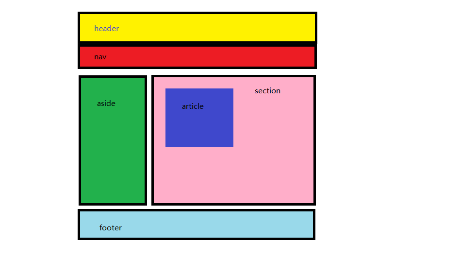

# 学习目标

> 能够写出4~5个常用的表单元素（input（多种形态）、select、textarea、form、label）
>
> 能够说出表单name属性和value属性的作用（告诉后端发送的数据是什么含义；发送给后端的数据。name（发送给后端数据的含义）= value（具体数据））
>
> 能够掌握表单元素checked和selected的使用（checked：单选和多选默认选中；selected：下拉菜单默认选中）
>
> div和span的使用（用于css中的布局）
>
> H5新增的语义化标签（header、nav、footer、section、article、aside）
>
> H5新增的属性（placeholder、autofocus、multiple）
>
> H5视频音频标签（audio、video）
>


**理解上课的知识点**......


# 表单系列标签（重点）

> 表单的目的是收集用户信息
>
> 注册页面
>
> 有一种生物叫做后端

## input (输入框系列) 基本表单控件

> 先简单的过一遍~

```html
<input type="text">

单标签、type：用于指定不同的控件类型
```


## 文本框 text 、 密码框 password

```html
昵称：<input type="text" value="小姐姐" name="nicheng" maxlength="6"> 
密码：<input type="password" name="password" maxlength="6">
```

**注意：**

- value (**基础班知道有这个属性就行~**)：用户输入的值（提前在标签设置好就是默认值）

- name (**基础班知道有这个属性就行~**)：告诉后端对应的值的含义。后端接收到的格式：`name的属性值=value的属性值`

  > 拓展：页面中的信息需要传给后台服务器，但是直接发一个值（value）过去，后端不知道是什么，所以需要加上一个属性name  代表数据的含义。
  >
  > 后端接收的数据结构为： name属性值=value属性值  这样后端就知道传过去的是什么（前后端交互在就业班会重点说明，基础班不会使用）

- maxlength：设置表单的最大输入值

**小bug** ：如果是密码输入框，`type="password"`  的password不能拼错且后面不能有空格，否则浏览器会认为type属性设置无效，会以默认的text方式显示，此时不会密文，相当于是文本框。


## 单选框 radio 、多选框 checkbox

### 单选框 radio

```html
性别 : <input name="sex" type="radio" value="nan"> 男 
      <input name="sex" type="radio" value="nv" checked> 女
```

**注意：**

- 通过name进行分组（有相同name属性值的单选框是一组的，一组中同时只能有一个选中），并且告诉后台传的是什么
- 在实际工作中，需要写value值
- checked 属性设置默认选中，属性值省略。

### 多选框 checkbox

```html
爱好：<input type="checkbox" name="hobby" value="code" checked>敲代码
     <input type="checkbox"  name="hobby" value="nosleep" checked>熬夜
     <input type="checkbox"  name="hobby" value="game">玩游戏 
```

- 通过name进行分组，并且告诉后台传的是什么
- 需要写value值
- checked属性设置默认选中，属性值省略

## 文件选择框 file

```html
<input type="file">   单文件上传
<input type="file" multiple>   多文件上传
```

**注意：**

- multiple设置一次同时可以选中多个文件（ctrl+选中/鼠标框选）属性值可以省略
- 现在html只负责结构，之后真正的上传相关功能通过js来实现

## 表单按钮

> 需要配合form表单一起使用
>
> 说白了就是用form标签把表单标签都包起来~

### 提交按钮submit

> 将表单的内容提交给后端

```html
<input type="submit">
```

### 重置按钮reset

> 将表单的内容重置为默认值

```html
<input type="reset">
```
### 普通按钮button

> 之后配合js使用

```html
<input type="button">    // 配合后面的js使用
```
### 图片按钮image

> 功能相当于提交按钮，样式为一张图片

```html
<input type="image" src="a.jpg">
```

## select 下拉菜单

```html
出生年月：<select name="year">
            <option value="1996">1996</option>
            <option value="1997">1997</option>
            <option value="1998">1998</option>
            <option value="1999" selected>1999</option>
		</select>
```

**注意：**

- name属性设置在select标签上（告诉后台传过去的是什么）
- value属性设置在option上，表示选中的值
- selected属性设置默认选中，属性值省略

## textarea文本域

> 用于输入大段文字

```html
<textarea cols="规定文本区内的可见宽度" rows="规定文本区内的可见行数">
  文本内容
</textarea>
```


**注意：**不能通过设置value使文本域有默认值，无效！

## Form 表单域

> form标签用于定义表单域，将各种表单包裹起来，用于表单提交

```html
<form action="url地址">
  各种表单控件
</form>
```

**属性：**action 用于指定处理请求的服务器URL地址（**就业班的内容**）

## label 标签（记忆）

> 示例 : [新浪网页注册](https://login.sina.com.cn/signup/signup?entry=homepage)

**作用：**让**文本**和**表单元素**绑定到一起（结拜兄弟）


**用法：**

- 写 for ，值为 id，规定 label 与哪个表单元素绑定

```html
性别 : 
<input  id="nan" name="sex" type="radio">  <label for="nan">男</label>
<input  id="nv" name="sex" type="radio"> <label for="id名">女</label>   

步骤：
1.在表单元素上添加id属性
2.给label添加for属性，for的属性值与对应表单元素的id值相同即可
```
- **不写 for**，默认绑定 label 内的表单控件

```html
<label><input type="radio" name="sex"> 男</label>

步骤：用label把表单元素和文字包在一起即可
```


# 没有语义的布局标签（记忆）

> div和span是没有语义的标签，一般用于页面布局使用（项目中会经常使用到）

## div：div盒子

```html
<div>长亭外</div><div>古道边</div>
```

**特点：**

- width由屏幕宽度决定（独占一行）height自适应（由内容撑开）
- 默认占一整行（一行只能显示一个）

**页面布局中用的最多~**

## span

```
<span>芳草碧连天</span>
```

**特点：**

- width、height由内容来决定（都由内容撑开）
- 一行里面可以显示多个

**除了没有语义的标签可以用于布局，还有一些有语义的标签可以用于布局**


# HTML5新标签与特性（了解）

> 就业班会有专门的H5C3的课，来学习html5的一些新标签和属性

## HTML5新增语义标签（记忆）

- **头部：header标签**

  ```html
  header：定义网页的头部---》头部语义 + div
  ```

- **导航：nav标签**

  ```html
  nav：定义网页的导航---》导航语义 + div
  ```

- **底部：footer标签**

  ```html
  footer：定义网页的底部---》底部语义 + div
  ```


- 侧边栏：aside标签

  ```html
  aside：定义网页的侧边---》侧边语义 + div
  ```

- 区块：section标签

  ```html
  section：定义网页的区块---》区块语义 + div
  ```

- 文章：article标签

  ```html
  article：定义网页的文章---》文章语义 + div
  ```



**注意：**html5标签有兼容性问题（老浏览器没效果），所以为了客户群多，会少用。


## 其他表单新属性(记忆)

| **用法**                                   | **属性**          | **含义**      |
| ---------------------------------------- | --------------- | ----------- |
| `<input type="text" placeholder="请输入用户名">` | **placeholder** | 提示用户输入对应的信息 |
| `<input type="text" autofocus>`          | **autofocus**   | 自动获得焦点      |
| `<input type="file" multiple>`           | **multiple**    | 多文件上传，可选多文件 |


## 多媒体标签—audio 音频

> 在网页中播放音频（声音）

**属性：**

- controls 是否显示播放控件 
- autoplay 自动播放（**有兼容性问题**）
- loop 循环播放（**有兼容性问题**）

**兼容性处理：**

```html
<audio controls autoplay loop>
  <source src="1.mp3">
  您的版本过低,请升级高级版本 <a href="http://www.itcast.cn/">点击下载</a>
</audio>
```


## 多媒体标签—video 视频

> 在网页中播放视频

**属性（和audio类似）：**

- controls 是否显示播放控件 
- autoplay 自动播放（**有兼容性问题**）（muted）
- loop 循环播放（**有兼容性问题**）

**区别：**可以设置宽高，并且显示视频

**注意：**宽度和高度只需要设置一个，另一个会根据等比例缩放，如果同时指定两个，视频的实际宽高会以小的为基准（类似图片）
