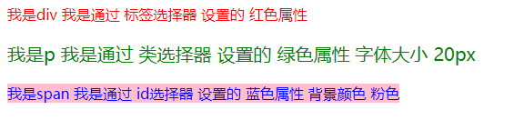

# 学习目标

> 了解CSS的作用（给页面添加样式）
>
> 能够使用font属性设置文字相关样式（font-style/font-weight/font-size/font-family）
>
> 能够使用chrome调试HTML/CSS代码
>
> 能够使用ID/类/标签选择器的作用（选择页面的标签，给其添加样式）
>
> 能够使用交集、并集选择器
>
> 能够使用后代/子代选择器的作用（选择页面的标签，给其添加样式）
>
> 几种设置颜色的方式（关键字（英文单词）、rgb(0,0,0)、rgba(0,0,0,0)、#FEFEFE）
>
> 。。。。。。


**理解上课的知识点**......


# CSS初体验

> css的作用是给页面中的元素（标签）设置样式（颜色、大小、字体、位置等等）

##### ヾ(๑╹◡╹)ﾉ"咱们首先给P标签一点颜色看看~

**特点：**css的相关设置都放在 style 标签中，style是一个双标签，它放在head里面，title下面

**结构：**

```html
<style>
	选择器 {
		属性名1: 属性值1;
		属性名2: 属性值2;
		...
	}
</style>
```

示例:

```html
<style>
	p {
		color: red;
		font-size: 30px;
	}
</style>
```

**总结：**css 是用来给页面上的结构添加样式的 (尺寸、颜色、位置等等)


## CSS的相关属性

```html
color：设置字体的颜色
font-size：设置字体的大小
background-color：设置背景(颜色)
width：设置宽度
height：设置高度
```


## CSS概念  

> 层叠样式表（Cascading style sheets）

**作用：** 给html标签设置样式 ( 给人穿衣服、化妆)

**注意：**

- 符号必须是英文状态下的
- 每一句样式键值对写完之后，必须记得加一个分号。


# 字体属性（font-）

## 字体大小

**font-size：**设置字体大小

```
font-size  设置字体的大小   
取值如：font-size: 12px;  
注意：在css大多数数值都需要添加单位
```

## 字体粗细

**font-weight：**字体的**粗细**

**取值：**

- 数字 :  正常(400)、粗(700)**（没有单位）**
- 关键字 : 正常(normal)、粗( bold )

## 字体风格

**font-style：**字体的样式 

```html
font-style 设置字体的风格(样式)
取值：
	normal 显示标准的字体样式（默认）
	italic 字体倾斜
```

##字体类型

**font-family：**字体类型

**注意：**

- 一些冷门字体很多电脑里面默认没有安装，此时会显示不出来。实际工作中，默认都是一些主流字体如宋体、微软雅黑等等......
- 字体可以写多组，中间用**逗号隔开**（第一个不兼容会使用第二个，第二个不行会使用第三个）可以同时设置几个字体类型隶书，楷体（UI给咱们什么，就写什么~）
- 你们写字体的时候，都要加上引号

**代码：**

```css
p {
    /* 样式: 斜体   默认:正常  斜体*/
    font-style: italic;

    /* 粗细  默认 : 正常  粗体 */
    font-weight: bold;

    /*  字体大小  默认: 16px ; */
    font-size: 116px;

    /* 类型  默认: 微软雅黑; */
    font-family: '隶书';
} 
```

**层叠性问题~**

## 连写形式

```html
font: 样式 粗细 大小 类型 
font: font-style font-weight font-size  font-family
font: italic bold 100px 宋体;
```
**记忆 :**

-  稍微舒服==swsf
- 或者直接记 : ` font: italic bold 40px '宋体';`

**省略：**

- 可以省略前两个

```js
font:  40px '微软雅黑';
```
**注意点：** 

- 连写是注意是swsf这个顺序
- 连写只能省略前两个
- 给同一标签设置的相同的属性，写在下面的样式会覆盖上面的样式！！
- 推荐样式单独设置使用！！！（一般用的最多的是font-size）


# 开发人员调试

> 开发者调试工具：调试、查错、找BUG。程序员的必备装备~

**打开方式：**

- 右键 --> 查看网页源代码："查看源码"

- 右键-->检查："检查元素/打开控制台"

**调试的作用：**

- 修改属性值（点击属性值）
  - 直接修改
  - 鼠标滚轮
  - 键盘的上下键
- 添加属性
  - 在上一个属性值的分号之后点击一下，就可以添加样式
- 控制样式生效
  - 点击每个属性前的小框，可以控制。
  - 如果样式中有一个删除线，表示该样式不生效（失效）
- 查看是否生效
  - 样式是否有删除线（一般都是被覆盖）
- 查看报错（原因）
  - 属性值之后没有分号（没有分号会认为这一行没结束）
  - 格式写的有问题（中文的标点）
  - 属性名或属性值有错误

**注意：**

- 在基础班只关注elements这个面板，右侧的style就是当前标签对应的css样式
- 在调试工具中修改，仅仅是改变了当前页面的样式效果，刷新之后就没有了，需要添加到代码中才行


# 简单（基本）选择器

> 标签选择器、类选择器、ID选择器
>
> 选择器就是用来选中对应的标签的，然后给选中的标签加上对应的样式

## 标签选择器（标签名） 

> 要求：四个标签都设置为红色

```html
<p>我是p标签</p>
<p>我也是p标签</p>
<div>我是div</div>
<div>我也是div</div>
```

**作用：**根据指定的标签名，来设置指定的标签的样式 

**结构：**

```html
 <style>
	标签名(选择器) {
		属性名1: 属性值1;
		属性名2: 属性值2;
		....
	}
</style>
```

**特点：**

- 标签选择器会选中页面中所有符合标签名的标签
- 标签选择器不管嵌套关系多深，都能选择到
- 标签选择器不能只选择一个，而是会选中所有这一类标签


## 类选择器（.）

> 要求：满足下面的要求（做衣服）

```css
/*没穿衣服的样子*/
<p>小红</p>
<p>小黄</p>
<p>小粉</p>
<div>我是一个想红的div</div>

/*穿好衣服的样子*/
<p class="red">小红</p>
<p class="yellow">小黄</p>
<p class="pink">小粉</p>
<div class="red">我是一个想红的div</div>
```

**作用：**根据指定的类名，来设置指定的标签的样式（穿衣服）

**结构：**

```
<style>
	.类名(选择器) {
		属性名1: 属性值1;
		属性名2: 属性值2;
		....
	}
</style>
```

**步骤：**

1. 声明自定义类名`.自定义类名 {属性1:值1;属性2: 值2;} `（先做一件衣服）
2. 给对应的元素添加class类名属性 class="自定义的类名"  （把衣服给标签穿上）

**效果：** 

- 所有拥有这个类名的这些标签都加上对应样式
- 可以给相同标签名的标签定义不同的样式（用的最多）

**注意：**

1. 类名的命名方式：数字  字母  下划线   **不能以数字开头！！**
2. 一个标签可以使用多个类选择器，每个类名之间以空格隔开 （覆盖问题-》层叠样式表）
3. 一个类选择器，可以用在多个标签上（一种衣服可以很多人穿-》撞衫）


## ID选择器(#)

> 要求：都设置不同的颜色，不用类选择器

```html
<p id="red">天选之人-红果果</p>
<p id="green">天选之人-绿泡泡</p>
<div id="lowred">我也想变红</div>
```

**作用：**根据指定的id，来设置指定的标签的样式（专属装备）

**结构：**

```
<style>
	#id名(选择器) {
		属性名1: 属性值1;
		属性名2: 属性值2;
		....
	}
</style>
```

**步骤：**

1. 声明id `#自定义id名字 {属性1:值1;属性2:值2;}`（做一件专属装备）
2. 给对应的元素添加属性 id="自定义id"  （调用id选择器，找到天选之人，给他穿上这件专属装备）

**效果:** 

- 会将拥有这个id名的标签加上对应的属性

  **特点 :一对一**

  （一个标签只能用一个id选择器 ,一个页面上也只能用唯一的id）

**注意点：**

- id属性相当于标签的身份证号码
  - 一个页面中的标签不能有相同的id，每一个标签的id都是唯一的！
- 一个标签上只能有一个id属性，并且唯一
- 一个id选择器只能选中一个标签
- id的命名规则和类名一样（规范）


> id 主要不是为了设置css样式，而且为了后面的js使用


### 特别注解：

#### id和class的区别

- id相当于身份证，不可重复，一个HTML标签只能绑定一个id属性

- class相当于姓名，可以重复，一个HTML标签可以绑定多个class属性

  

#### id选择器和class选择器的区别？

- id选择器以#开头
- class选择器以.开头


#### 实际开发情况

- 使用最多的是class选择器
- id一般情况下是给js使用的，所以除非特殊情况，否则不要用id去设置样式。
- 实际公司开发要注意代码的**冗余代码的抽取**，可以将一些公共的代码抽取到一个类选择器中

##### ヾ(๑╹◡╹)ﾉ"课堂练习小练习: 



##### ヾ(๑╹◡╹)ﾉ"课堂练习小练习: 

```
  <p>我是p标签,我想变大，不想变红</p>
  <p>我是p标签，我想变红，不想变大！！</p>
  <div>我是div，我想变红，我想变大</div>
```


# 复杂（复合）选择器

## 通配符选择器（*）

> 需求 :把页面内所有的元素都设置一个颜色为red

```html
<h1>标题</h1>
<div>小姐姐</div>
<p>小帅哥</p>
<h2>我是h2</h2>
<p>小可爱</p>
<span>大可爱</span>
```

**作用：** 会将页面上所有的标签都设置这个样式

**代码：**

```html
<style>
	* {
		属性名: 属性值;
	}
</style>
```

**注意:** 

- 通配符会去页面上一个个的遍历页面所有的标签，然后给他们进行设置样式（效率低，不要滥用）


## 并集选择器（，）

> 需求：把div和p的设置红色（节省代码的方式）

```html
<!-- 给div 和p标签设置red色 节省代码的方式  -->
<div class="red">小帅哥</div>
<p>小姐姐</p>
<p>小可爱</p>
<span id="biglovely">大可爱</span>
```

**作用 :** 将满足多个选择器类型的标签全部选择出来

**代码 :** 

```html
<style>
	选择器,选择器 {
		属性名1: 属性值1;
	}
</style>
```

**注意 :**

- 并集选择器可以同时写很多的选择器 ，只要每个选择器之间以**逗号隔开** 
- 并集选择器中的选择器，可以是标签选择器、类选择器、id选择器、等等......


## 交集选择器

> 需求：只让小可爱变红

```html
<!-- 只让小可爱变红  其他的是默认的颜色  不能改变html中的代码 -->
<div class="red">小姐姐</div>
<p>小帅哥</p>
<p class ="red">小可爱</p>
```

**作用：** 从两个集合中选择他们相同的部分

```
既又原则 
例如：p.box {}  既是p标签 又有box类名
```

**代码：** 

```js
选择器1选择器2 {
	属性名1: 属性值1;
}

该标签既能被选择器1选中，又能被选择器2选中
```

**注意：**

- 两个选择器是紧密挨着的，中间不能有其他任何东西
- 如果交集选择器中标签选择器，标签选择器写在最开头
- 交集选择器可以同时写多个选择器


## 后代选择器（空格）

> 需求：完成下面的要求

```html
<!-- 不准改下面的html结构 只让小姐姐变红-->
<div class="father"> 
    <p>小姐姐</p>
</div>
<p>小可爱</p>
```

**作用 :**  选中满足条件的后代元素（后代 : 儿子、孙子、重孙子......）

**代码 :** 

```html
<style>
	.father p {
		color: red;
	}
</style>

选择器1 选择器2 {
	属性名1: 属性值1;
	....
}
```

**步骤：**

1. 通过选择器1找到一堆标签
2. 找到这一对标签的所有的后代标签
3. 在这些后代标签中，找到满足选择器2的标签，给这些标签加上样式


## 子代选择器（>）

> 需求：完成下面的要求

```html
<!-- 只让小可爱变红  其他的不变颜色  不准更改html的结构 -->
<div class="father">
    <p>小可爱</p>
    <div>
        <p>小姐姐</p>
    </div>
</div>
<p>大可爱</p>
```

**作用 ：**选中满足条件的直接子代元素 （子代 : 儿子）

**代码 :** 

```css
<style>
	.father > p {
		color: red;
	}
</style>

选择器1 > 选择器2 {
	属性名1: 属性值1;
	....
}
```

**注意：**

- 只找的是自己的儿子辈

##### ヾ(๑╹◡╹)ﾉ"项目中的情况（时间不够留给作业）

```html
<!-- 主导航栏 -->
<div class="nav">    
  <ul>
    <li><a href="#">公司首页</a></li>
	<li><a href="#">公司简介</a></li>
	<li><a href="#">公司产品</a></li>
	<li>
         <a href="#">联系我们</a>
		 <ul>
		    <li><a href="#">公司邮箱</a></li>
		    <li><a href="#">公司电话</a></li>
		 </ul>
	</li>
  </ul>
</div>
<!-- 侧导航栏 -->
<div class="sitenav">    
  <div class="left">左侧侧导航栏</div>
  <div class="right"><a href="#">登录</a></div>
</div>
```

在不修改以上代码的前提下，完成以下任务：

1. 链接登录的颜色为红色，同时主导航栏里面的所有的链接改为粉色（简单）
2. 主导航栏和侧导航栏里面文字都是14像素并且是微软雅黑（中等）
3. 主导航栏里面的一级菜单链接文字颜色为绿色（难）

**答案：**

```html
.right a {
	color: red;
}
.nav a {
	color: pink;
}
.nav,.sitenav {
	font-size: 14px;
	font-family: '微软雅黑';
}
.nav>ul>li>a {
	color: green;
}
```

**小注意：**

- 基本选择器是必须熟练使用的
- 复合选择器需要配合项目多次使用才能熟练使用，第一次很难确定什么时候使用这是很正常的，之后的项目中跟着老师一起练即可


# 拓展的小细节

## 颜色的属性（知道即可）

**颜色的取值可以是：**

- **具体的颜色的英文单词：** 

  yellow，pink，red，purple（常用的颜色单词要记住，案例中会经常使用）

- **rgb 表示法**（三种颜色的比例）

  r：red     g：green   b：blue  

  

  rgb（0,0,0）分别表示red、green、blue的比重，数值范围0~55

  白？黑？红？绿？蓝？

- **rgba 表示法**， 最后一个表示**透明度** （0~1）

  省略写法：rgba( 0, 0, 0, 0.5 ) —》 rgba( 0, 0, 0, .5 )

- **十六进制表示法**  #CFCFCF

  **特点：**

  1. 以#开头的十六进制
  2. 前两位代表红色，中间代表绿色，最后代表蓝色
  3. 不区分大小写
  4. 如果三组都是重复的，可以简写  #aabbcc=》#abc

- **之后会量颜色或者UI给你，不是自己肉眼看，所以直接拿来用就行。**

## 注释

**作用：**可以让页面上的一段代码让他们失去作用，浏览器不解析他们（和html的注释差不多，就是格式不一样）

```html
<!-- -->: html 中的注释, 不能嵌套
/*    */: css 中的注释, 不能嵌套
```

注释快捷键：Ctrl + /