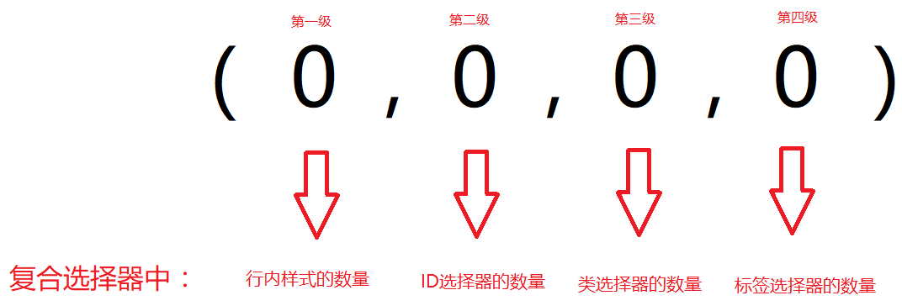

# 学习目标

> 能够说出三种CSS的书写位置（内嵌、行内、外联）
>
> 能够使用text开头的几个属性（text-align，text-indent、text-decoration）
>
> 能够使用margin：0 auto（盒子（div、p、h）居中）
>
> 能够说出CSS三大特性（继承性、层叠性、优先级）
>
> 能够说出CSS能够继承的属性（color、text-、font- 、line-等）
>
> 能够计算CSS选择器的权重（0,0,0,0）
>
> 。。。。。。


**理解上课的知识点**......


# CSS的三种书写位置

> 内嵌（嵌入）样式表、行内样式表、外联（外部）样式表

### 内嵌样式

> 将css语句都写在style标签里面（写了很久了）

**位置：**

- head标签里面，title标签下面，style标签里面

**作用范围：**

- 当前页面

```html
<style>
    div {
    	color: red；
        font-size：100px；
    }
</style>
```

**作用：**

- 一般用在小demo或者小案例的时候用到，用的稍多


### 行内样式

> 将CSS样式直接写在标签本身上，以属性的形式存在 

**位置：**

- 标签里面（双标签------》开始标签）

**作用范围：**

- 当前标签

```html
<div style="color: red; font-size: 100px;">小可爱</div>
```

**作用：**

- 之后的学习的js操作的都是行内样式，用的较少，基础班最好别用


### 外联样式

> 单独创建一个后缀名为.css的文件，在html文件里面通过link标签引入css文件

**步骤：**

- 新建一个文件, 后缀叫 .css
- 在这个文件中直接通过 link 引入

**位置：**

- 新建一个新的css文件
- 在title下面引用

**作用范围：**

- 哪个页面引入，那个页面有效果

```html
<link rel="stylesheet" href="路径" >
```

**作用：**

- 用的最多的一种，一般在项目中会用到。推荐使用

### 三种样式表总结

|  样式表  |      作用范围      |         存放位置         |          应用          |
| :------: | :----------------: | :----------------------: | :--------------------: |
| 内嵌样式 |      当前页面      | head里的title下面的style |   存放当前页面的样式   |
| 行内样式 |  只作用于当前标签  | 通过标签的style属性设置  | 只给一个标签使用（js） |
| 外联样式 | 所有页面都可以使用 | 在html文件中通过link引入 | 存放很多页面的公共样式 |


# text- 文本相关属性

### text-indent：文本的缩进

> 设置文字的缩进

**取值：**

- px（像素）
- em（一个文字的大小）

**注意：**

- 单位是 em，1em代表一个文字的宽度 ，2em标签首行缩进两个字符。

### text-align：文本的对齐方式

> 设置文字的对齐方式（水平居中）

**取值：**

- left：设置`内容`在盒子中 **靠左**

- center：设置`内容`在盒子中 **水平居中**
- right：设置`内容`在盒子中 **靠右**

**注意：**

- 能让哪些元素位置居中???

  文本、图片（行内块），span（行内）


### text-decoration：文本的修饰

> 设置文字的修饰（下划线、删除线等）

**取值：**

- none：没有任何装饰（去掉多余的样式）
- underline：下划线
- line-through：删除线

**注意：**

- 一般用的最多的是用text-decoration：none，取消a标签的默认下划线。


**总结：**strong、ins、em、del已经全部都css替换掉了

- strong--------》font的bold：加粗
- ins---------》underline：下划线
- em--------》font的italic：斜体
- del--------》line-through：删除线


# 让盒子水平居中

> 项目中会经常用到让盒子（div、p、h）水平居中

```
margin: 0 auto;
```

**作用：** 可以让`盒子`水平居中

**条件：**

- 有**宽度**的**盒子**（div、p、h），独占一行是div的效果，但是总体上来说不算居中。

**区别：**

`margin:0 auto;` 和`text-align` 的区别

- 一个是盒子本身居中
- 一个是盒子里的内容居中

##### ヾ(๑╹◡╹)ﾉ"改写昨天的新闻案例


# CSS的三大特性

> 解释css的一些效果~

## 继承性

> 后代元素会继承祖先元素的一些样式（子承父业）

```html
<div class="father">父亲
	<div class="son">儿子</div>
</div>
```

**开发者调试工具的使用！**

**有哪些样式属性可以继承（没说就是不能继承）：**

- color：颜色
- font- 开头的：字体相关属性
- text- 开头的：文本相关属性
- line- 开头的：line-height
  - 开发者调试工具中的**computed**

**应用：**可以省略自己的代码。比如 `list-style：none；`  一般给ul设置，此时可以利用继承性

**注意（继承的失效）：**

- a链接颜色不能通过继承设置，需要单独设置（a标签有本身的样式）
  - a标签有默认的样式，要给a标签设置样式，需要单独选中后设置！
- h系列标签字体大小不能通过继承设置，需要单独设置（有本身的样式）
- div的高度不能继承，宽度默认有继承父元素的效果
- 元素如果自身有CSS样式，那么该样式不予继承（独立）
- 以后敲代码别想着用继承就少写代码，该设置的代码一个别省（**不要用css的继承性偷懒**）


## 层叠性

> 浏览器解决样式冲突的特性

**特点：**后渲染的css样式会覆盖掉先渲染的css样式 （优先级相同的情况下） 

```
层叠的属性不一样------》叠加
层叠的属性一样-------》覆盖（下面的生效）
```

**例子：**

```html
<style>
    .red {
    /* 最终绿色起效果 */
    	color: green;
    	color: red;
    }
    .green {
    	color:green;
    }
</style>

<div class="green red">小姐姐</div>
```

## 优先级（重要）

> 给页面中的一个标签设置样式，可以通过多种方法~
>
> 当设置的样式层叠的时候，需要考虑优先级（权重）

### 优先级

> 不同的基础选择器有不同的优先级

```
继承 < 通配符 < 标签选择器 < 类选择器 < ID选择器 < 行内样式 <　!important
```

**！important：**无法提高继承的优先级（继承还是继承，优先级还是最低的），并且注意格式的问题

**例子：**

> 不同的选择器选中同一个标签，选择器设置相同的样式，此时听谁的？

```html
<div class="father">
    父亲
    <div class="son">
        儿子
        <div class="grandson">
            孙子
        </div>
    </div>
</div>
```


### 权重

> 当面对复合选择器的时候，需要考虑权重的计算

**计算公式：**

公式算法：（0,0,0,0）



- 第一个数字：行内样式的个数
- 第二个数字：ID选择器的个数
- 第三个数字：类选择器的个数
- 第四个数字：标签选择器的个数

**注意：**

- 从第一级开始比较，如果第一级大,，那么就大； 如果第一级一样， 那么就比第二级......

- **!important**如果能选中对应的标签，则权重最高，天下第一！！

- 权重其实就是计算优先级的算法！！

- 计算的步骤

  ```
  第一步 : 是不是能选择到该标签（继承------》pass掉）
  第二步 : 使用公式（0,0,0,0） 
  ```

**补充一点：**浏览器解析选择器的时候，实际是用右往左解析的，所以**尽量少使用层级关系**（涉及到算法的遍历）