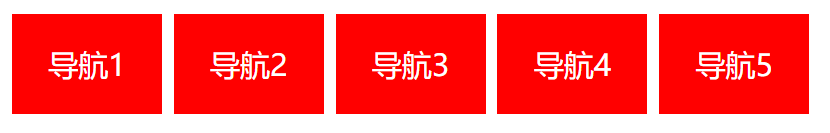

# 学习目标

> 能够说出background相关的几个属性（color、image、repeat、position）
>
> 能够使用background设置颜色和图片（color、image）
>
> 能够使用background-position设置背景图片的位置（left、center、right）
>
> 能够说出元素的三种显示方式（块级元素、行内元素、行内块元素）
>
> 能够使用display转换元素的显示方式（display：block/inline/inline-block）
>
> 能够说出行高的概念并且使用（基线的距离、让文字垂直居中）
>
> 能够说出a链接的四种伪类（lvha：link、visited、hover、active）
>


**理解上课的知识点**......


# 背景相关的属性（background）

## 背景颜色

> 设置标签的背景颜色

**代码：**`background-color: red;`

**取值：**

- 可以是之前介绍的几种~（前端只需要会写就行了，具体的值是UI设计好的）


## 背景图片

> 设置标签的背景为图片

**代码：**`background-image: url(图片路径);`

**注意：**

- 背景图片默认平铺


## 背景平铺

> 设置标签的背景图片是否平铺

**代码：**`background-repeat: no-repeat；`

**取值：**

- repeat：平铺 （默认值）
- no-repeat：不平铺
- repeat-x：水平平铺
- repeat-y：垂直平铺


## 背景位置

> 设置背景图片的位置

**代码：**`background-position: 水平方向的位置（x） 垂直方向的位置（y）；`

**取值：**

- 关键字
  - 水平方向：left、center、right
  - 垂直方向：top、center、bottom

- 像素：当前盒子的左上角为（0,0）原点，构建一个坐标系。第一值是X轴的位置，第二个值是Y轴的位置 交互的点就是图片左上角顶点开始显示的起始位置。
  注意：
  	1、浏览器里面的坐标系X轴水平向右  Y轴垂直向下
  	2、注意顺序

## 背景的连写

> 背景属性相关的连写形式

**代码：**`background: #fff url() no-repeat  center center;`

**注意：**

- background：背景颜色 背景图片地址 背景平铺  背景位置;（推荐使用这个顺序！）

- 省略：

  ```css
  background: color image repeat position;
  省略 :  color /  image repeat position;（相当于background-color）
  
  省略的特殊情况
  	当div（盒子）的大小和背景图片的尺寸一样的时候
  	当div（盒子）大小=背景图片的大小
  	可以只写  background:url(200.jpg);  相当于只写background-image
  ```

- 注意写省略时候有覆盖的问题（省略写法，没写就是默认值，默认值也会覆盖！）

##### ヾ(๑╹◡╹)ﾉ"英雄联盟案例（熟悉背景操作即可）

##### -----------------------------

# 标签的三种显示方式（重要，必会！！）

> 看看div、p、span、a的效果~
>
> div独占一行、宽度默认继承父盒子、高度由内容撑开
>
> span一行显示一个、宽度和高度都是由内容撑开

## 块级元素

> 查看div的computed搜索：display

**属性：**display : block  ; 

**特点：**

- 独占一行一行、只能显示一个  （有时候就需要这种的，不算缺点）
- 默认宽度是父级标签的宽度
- 可设置宽和高（优点）

**代表：**

- div、p、h系列（记住）

  ```
  div,p,ol,li,ul,dt,dd,dl,header,footer,aside,nav,article,section
  ```

**注意：p这种段落标签不要嵌套块级元素**（**惊天BUG**）


## 行内元素

**属性：**display : inline；

**特点：**

- 一行可以显示多个 (优点)、不独占一行
- 宽度由内容决定，盒子大小完全是被内容撑开
- 无法设置宽高   (缺点)

**代表：**  

- span、a

  ```
  a,span,b,u,s,i,strong,ins,del,em
  ```

  

## 行内块元素

> 行内元素演变成现在的行内块元素的

**属性：** display: inline-block ; 

**特点：**

- 一行可以显示多个 (像是行内)
- 可以设置宽高  (像是块级)

**代表：**  input、img、textarea、select、button


## 三种显示方式的转换

- `display: block;` 转成块级
- `display: inline;` 转成行内
- `display: inline-block;` 转成行内块

##### ヾ(๑╹◡╹)ﾉ"low导航（都是a标签 60*40）字体大小12px



##### -----------------------------

# 行高（line-height）

> 两行文本之间基线的距离就是行高（默认值为normal），可以撑起高度

**作用：**控制的是文字与文字之间的上下距离

```css
line-height:20px;
```

**注意：**

- 小技巧：如果将标签的高度和行高设置成一样，那么这个标签里面的文字可以在这个标签里面垂直居中
- 与text-align结合使用可以让单行文字在标签内部水平垂直居中


# 链接伪类选择器(了解)

> 选择的元素的一种状态，并只是找到元素就没了

## 链接伪类选择器介绍

> 回顾a链接的特性

```js
(1) a:link {
		color: red;
		font-size: 18px;
	}
	作用: 给a标签设置`没有被访问过`的样式

(2) a:visited {
		color: blue;
	}
	作用: 给a标签设置`访问过`的样式
	一般这个只设置 color, 其他属性会无效

(3) a:hover {
		color: pink;
		font-size: 20px;
	}
	作用: 给a标签设置 `鼠标悬停`的样式

(4) a:active {
		color: green;
		font-size: 30px;
      
     // 背景颜色不能设 
	}
	作用: 给a标签设置 ` 激活(点击中) `的状态
```

## 链接伪类选择器注意点

- 一般一起使用设置某个属性，都设置某一个属性

- 顺序固定

  ````
  link visited hover active
  lvha => 看见lv包就ha
  ````

- hover必须记住（可以加给其他元素），其他的几乎不用

##### ヾ(๑╹◡╹)ﾉ"五彩导航

# 居中方法小总结

## 让标签中的内容（文本、图片、span）水平居中

```
text-align:center
1.文本
2.行内块元素（input/img）
3.行内元素（span/a）
```

## 让标签中的内容（文本、图片、span）垂直居中

```
line-height：标签的高度；
1.文本
2.行内块元素（input/img）注意：img需要加 vertical-align : middle（垂直对齐方式居中）
3.行内元素（span/a）
```

## 让盒子自身水平居中

```
盒子自身设置 margin:0 auto;
```

## 让盒子自身垂直居中

```
之后学习的定位
```
