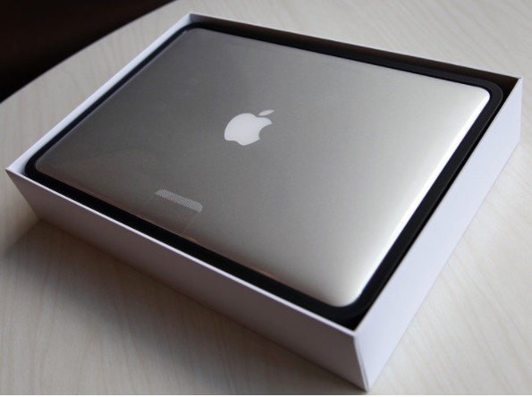
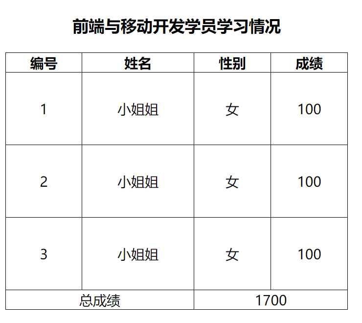
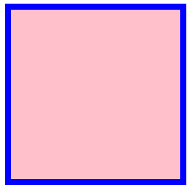
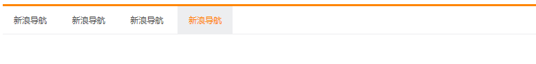

# 学习目标

> 能够说出盒子模型的组成（content、padding、border、margin）
>
> 能够使用border的相关属性（width、color、style）
>
> 能够使用border-collapse实现边框合并
>
> 能够计算盒子的实际大小（content+padding+border）
>
> 能够说出*{margin:0;padding:0;}的作用
>
> 。。。。。。


**理解上课的知识点**......


# 盒子模型

> 一种思维方式（万物皆盒子）


## 盒子模型的组成

> 盒子模型的四个组成部分



- content（内容/电脑）+padding（内边距/海绵）+border（边框/白色纸壳）+margin（外边距/盒子与盒子间的距离）

## 边框（border-边框-盒子的外纸壳）

**属性：**

- border-width: 边框的宽度（10px）；
- border-style: 边框的样式；
  - solid : 实线 （用的最多）
  - dashed : 虚线
  - dotted : 点线
- border-color: 边框的颜色；
  - 有颜色：red、#fff、rgb()等等
  - 透明：transparent

**连写：**

```js
border: 边框大小  边框样式 边框颜色;
border: 1px solid blue;  // 不要记上面那个，就记这个即可 （用的最多）
快捷方式：bd+ + tab  以后使用，都用连写，基本不会单独写
```

**方向：**

> 单独设置盒子的一条边框

```
border-方位名词:边框大小 边框样式 边框颜色;
比如：
    border-left 左边框
    border-right 右边框
    border-top 上边框
    border-bottom 下边框
```

**补充：**

- 细线表格 `border-collapse:collapse；`

  

- 使用开发者工具查看盒子模型（计算盒子的大小，**初级计算公式**）

  ```html
  <!-- 需求 : 
  	盒子尺寸 400*400 , 背景绿色, 边框: 10px 实线 黑色 
  -->
  注意：
  	1.css设置的height和width设置的是内容的宽高
  	2.添加边框会让盒子变大
  
  解决：
  	在设置边框之后根据初级公式，把height和width手动减去多出的部分
  	（手动内减）
  
  解决方案：盒子内容 380*380 , 背景绿色, 边框：10px 实线 黑色
  ```

##### ヾ(๑╹◡╹)ﾉ"写一个小盒子（由内容和边框组成）



##### -------------------------------

##### ヾ(๑╹◡╹)ﾉ"不low导航~



## 内边距（padding-内边距-盒子的泡沫）

> 盒子边框与内容之间的距离

**取值：**

- **一个值：**控制整个上下左右 `padding : 40px；`

  上、右、下、左 的内边距都设置了 40 px的距离;

- **两个值：**第一个控制上下 第二个控制左右  `padding : 40px 80px`

  上下 => 40px   ,   左右 => 80px 

- **三个值：**第一个控制的上 第二个控制的左右 第三个控制的下 `padding : 40px 60px 80px;`

  上 => 40px , 左右 => 60px , 下 => 80px 

- **四个值：**分别控制：上右下左 `padding : 40px 60px 80px 100px;`

  上 => 40px , 右 => 60px , 下 => 80px , 左 => 100px

- **记忆：**顺时针，上右下左，没有找对面

**单独设置（方向）：**

```
padding-top
padding-right
padding-bottom
padding-left
```

## 计算盒子的大小

> 盒子大小与内容大小的区别

- 盒子大小公式 : 

```html
<!-- 需求 : 
	盒子尺寸 300*300 , 背景粉色, 上下左右20px的padding(此时盒子大小是多少？？) 边框: 10px 实线 黑色 
-->

// 左右相等 
盒子宽度 =  内容宽度 + 2*padding + 2*border  
// 左右不等
盒子宽度 =  内容宽度 + padding-left+padding-left + border-left
 		   + border-right ;

```

> 那盒子高度是多少？

- **盒子大小：**边框、内边距、内容决定的
- 我们之前设置的width 和 height 都只是设置**内容的大小**

**注意（不会撑大盒子的特殊情况）：**

- 当一个大盒子包含一个小盒子，并且两个盒子都是块级元素，小盒子宽度继承父盒子，这时候给小盒子加padding-left，是不会改变小盒子大小的 （下面的都可以）
  - padding-left（用的最多）
  - padding-right
  - border-left
  - border-right


##### ヾ(๑╹◡╹)ﾉ"新浪导航（不low导航升级版）~

> 用之前的方法，当a标签的文字数量不确定时，页面会有问题。
>
> 普遍的方法应该使用padding


##### ------------------------------

**让浏览器自动内减（拓展css3）~** 

```html
<!-- 需求 : 
	盒子尺寸 400*400 , 背景绿色, 边框: 10px 实线 黑色  padding:20px
-->
box-sizing：border-box；（自动内减，此时width和height就是当前盒子的实际大小）
```


##### ヾ(๑╹◡╹)ﾉ"新闻列表案例~

## 外边距（margin-外边距-盒子与盒子之间的距离）

> 盒子与盒子之间的距离（控制盒子的位置）

**取值：**

- **一个值**：控制整个上下左右 `margin : 40px；`

  上、右、下、左 的内边距都设置了 40 px的距离;

- **两个值：**第一个控制上下  第二个控制左右  `margin : 40px 80px`

  上下 => 40px   ,   左右 => 80px 

- **三个值：**第一个控制的上 第二个控制的左右 第三个控制的下 `margin : 40px 60px 80px;`

  上 => 40px , 左右 => 60px , 下 => 80px 

- **四个值：**分别控制：上右下左 `margin : 40px 60px 80px 100px;`

  上 => 40px , 右 => 60px , 下 => 80px , 左 => 100px

**单独设置（方向）：**

```
margin-top
margin-right
margin-bottom
margin-left
```

**针对margin单方向的应用：**

- 上下应用
  - margin-top：能让盒子下移
  - margin-bottom：能让下面的盒子往下移

- 左右应用（先转换成行内块）
  - margin-left：能让盒子右移
  - margin-right：能让右边的盒子往右移动


## 清除默认内外边距

> 很多标签默认带有margin和padding，在布局之前需要清除这些标签默认的margin和padding，留给自己设置。

比如：

```
(1) body 标签: 自带 margin: 8px; 的属性
(2) p 标签: 默认带有 margin: font-size 的值
(3) h 标签: 也默认带有 margin-top 和 margin-bottom
(4) ul标签: ul 标签默认带有上下的 margin, 和 padding-left
...
```

**方法（清除页面中标签的默认padding和margin）：**

```
* { 
	padding: 0;
	margin: 0; 
}
```

##### ------------------------------

##### ヾ(๑╹◡╹)ﾉ"爱宠知识案例~

# 拓展

- 之后工作中，用什么软件测量都可以，顺手就行
- box-sizing：border-box；（自动内减，此时width和height就是当前盒子的实际大小）


