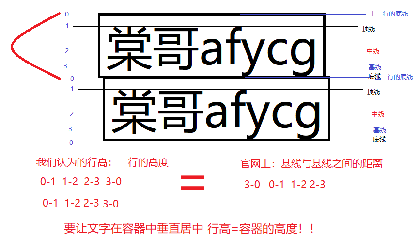
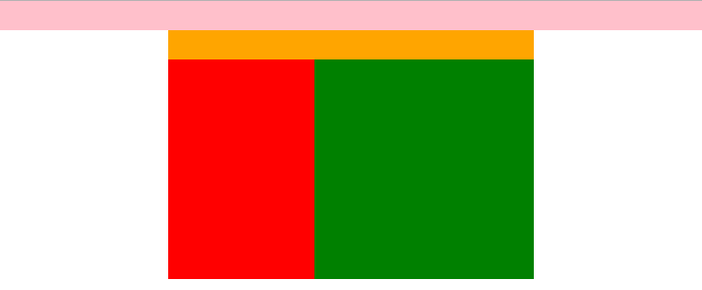
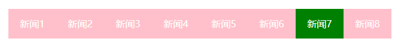

# 学习目标

> 了解margin合并与塌陷现象（相邻块元素垂直外边距的合并，嵌套块元素垂直外边距的塌陷）
>
> 能够说出解决margin塌陷的几种方式
>
> - 给父盒子加一个边框
> - 给父盒子加 padding-top 
> - 给父盒子设置属性 overflow: hidden => BFC;
> - 给父盒子设置浮动
> - 给父盒子设置为行内块
>
> 理解浮动的作用及特点（解决上下盒子 可以水平布局的问题，脱标）
>
> 能够说出几种清除浮动的方式（额外标签法、overflow、伪元素清除浮动）
>
> 能够使用浮动完成导航案例
>
> 能够说清除浮动的目的（消除浮动对之后元素的影响）
>


**理解上课的知识点**


# 行高（line-height）（补充说明）

**定义：** 两行文本基线的距离



**应用：**将行高设置等于容器的高度，可以让文本垂直居中

**注意：**行高是可以继承的


## 行高的单位

**取值：**

- 具体的像素

- em 

  根据当前标签的**字体大小（font-size）**为基数计算（没有手动设置，浏览器默认设置16px）

  > 如果当前字体大小为16px，那么 2em=32px

- 百分号（%）

  根据当前标签的**字体大小（font-size）**为基数计算

  > 如果当前字体大小为16px，那么 200% = 32px

- 不带单位的数字（倍数）

  根据当前标签的**字体大小（font-size）**为基数计算

  > 如果当前字体大小为16px，那么 2 = 32px

**补充：** 谷歌浏览器默认字体大小 16px;


## 行高与font的连写

字体连写里面还有行高（默认值：**normal**）

> 默认值为：normal，不同的文字效果不同，

**完整版的font连写形式：**

`font: font-style font-weight font-size/line-height font-family`

**line-height 如果写在 font 连写前面，会被层叠掉** （连写的层叠现象）

```css
/*line-height书写位置：*/
/*1. 写在font里 没毛病 */
font: italic bold 20px/200px '微软雅黑';

/*2. 写在font后面  没毛病*/
font: italic bold 20px '微软雅黑';
line-height: 200px;

/* 3. 写在font前面 会覆盖  */

line-height: 200px;
font: italic bold 20px '微软雅黑';
/*此时line-height为normal值*/
```


**注意（项目中用到了line-height和font的连写）：**

- 把line-height写在font连写的下面
- 把line-height写进font的连写里面！


# margin的两种特殊现象（了解）

## marign的合并现象

> 当两个盒子**水平**布局时，左右的margin会叠加；
>
> 当两个盒子**垂直**布局时，上下的marign会合并-》合并之后取两者的最大值为两个盒子之间的距离

```js
// 盒子左右排序  没毛病
 margin-left 和 margin-right 叠加

// 盒子上下排序  有问题
margin-top 和 margin-bottom 合并

// 总结 : 
两个div上下排序, 在进行设置 margin-top 和 margin-bottom 的时候,两个margin会产生一个合并的现象, 合并的值以大的为准
```


**解决方案：**   避免就好了

## margin的塌陷现象（面试和考试必考！）

> **嵌套** **块元素**垂直外边距的塌陷（父元素一起往下移动）
>
> 两个盒子为父子关系时候，父元素的marign和子元素的margin会合并，并且父元素会往下移动

```
如果一个大盒子中包含一个小盒子, 给小盒子设置 margin-top 大盒子会一起向下平移
```


##### ----------------------------

**解决方案：**

- 给父盒子加一个边框
- 给父盒子加 padding-top 
- 给父盒子设置属性 overflow: hidden => BFC;
- 给父盒子设置浮动
- 给父盒子设置为行内块

# 浮动

## 浮动初体验

> 解决上下盒子 可以水平布局的问题

**需求：**在页面上有两个盒子，一个盒子靠着左边显示，一个盒子靠着右边显示

可以使用marign，但是浏览器宽度变化时，不能完成效果~

**浮动的代码：**

```css
float: left;
float: right; 
```

## 浮动的特点（了解）

> 重点在于使用

**标准流：**就是浏览器默认摆放盒子的顺序（从上往下、从左往右）

**注意：**

- 浮动的元素会脱离**标准流（脱标）**

  - 飘起来了
  - 在标准流中不占位置

  ```
  如果一个元素按照正常的标准流来显示, 会在 html 中所属的位置占位, 后面的元素会紧跟着它, 但是浮动脱离了标准流, 将来在看到浮动的元素以后,就不能以正常的标准流来判断了 (浮动的元素在标准流中不占位置了)
  ```

- 浮动以后的元素，会覆盖在标准流的**元素之上**

   - 比标准流高出半个级别

- 浮动的规则：浮动找浮动，不浮动找不浮动 

- 浮动的重点：浮动的元素只会影响下面的元素  

   - 本质：浮动的元素受到盒子边界的限制（块级元素独占一行）

- 浮动的元素会改变显示方式效果

   ```
   浮动以后的元素当做是一种特殊的显示效果：
   1、一行可以显示多个
   2、并且可以设置宽高
   总结: 浮动以后的元素的显示方式与行内块级元素类似，但是不能使用text-align：center居中（浮动本身就是让盒子左右排布的）
   ```

**记忆 :** 

```js
1. 浮动的元素会脱标 ==> 飘起来了（不占位置） ==> 比标准流高半个级别  ==> 类似行内块的特点
2. 浮动的元素会被盒子的边界限制住
```

## 浮动的案例

- 使用浮动完成页面的布局



##### ----------------------------

- 制作导航

  注意：之前直接使用 a 标签 display：inline-block 制作导航是有问题的

  - 导航与导航之间应该是列表关系，如果想要将这些关系通过 html 语义化表示出来，必须要用到 ul 标签
  - 如果这些 a 标签不用其他的标签包裹起来，那么将来浏览器会将这些 a 标签中的文字，当做普通文本一起显示，SEO 在查看页面时，认为该页面在作弊，就是在进行关键字堆砌

  所以, 导航必须要用 ul 和 li 将 a 标签包裹起来 



```
*：项目开始前先初始化样式
ul:用于清除小圆点：list-style
li:用于浮动在水平方向布局：float：left
a：用于设置宽高（把li的大小撑起来）
	注意a标签是行内元素，需要通过
		1.转换显示方式（块级元素和行内块都行，但是不推荐使用行内块）；
		2.float：left 也能起效果（浮动之后的元素可以设置宽高）
```

## 清除浮动（清除浮动的影响）

> 浮动带来的问题：浮动元素撑不开父级容器

如果一个父盒子中有一个子盒子，并且父盒子没有设置高，子盒子在父盒子中进行了浮动，那么将来父盒子的高度为0，由于父盒子的高度为 0，下面的元素会自动补位，所以这个时候要进行浮动的清除

```
浮动: float: left; float: right;
清除浮动: clear: both;
```

#### 额外标签法

> 不推荐，会产生一个多余的盒子

在浮动的盒子内部**最后**，再放一个**块级标签**，在这个标签内使用 `clear：both；`来清除浮动对页面的影响

**注意：** 一般情况不使用这种方式清除浮动，因为这种方式会在页面中添加额外的标签


#### 使用 overflow 清除浮动

> 在某些特定场景下使用不了

找到浮动盒子的父元素, 再在父元素中添加一个属性 `overflow: hidden; ` 清除父元素中子元素浮动对页面的影响

**注意：** 一般情况用的也是很多也不用这种方式，因为 ` overflow: hidden; ` 有一个特点，离开了这个元素所在的区域以后会被隐藏 （后面讲这个方法就懂了）


#### 使用伪元素清除浮动

> 通过css实现，推荐！

**伪元素：** 在页面上不存在的元素，但是可以通过  css 添加上去（默认是行内元素）

**种类：**常见的就2种

```
::after(在...之后)
::before(在...之前)

为了和伪类的一个冒号区别，css3的时候推荐使用两个冒号（兼容还是要使用一个冒号）
```

**注意：**  

- 伪元素由css渲染，不会增加html结构
- 每个元素都可以添加自己的伪元素
- 默认伪元素是行内元素，可以通过 display 修改

伪元素清除浮动完整代码：

```css
.clearfix::after {
	content: "";     //伪元素必须给这个content=''
    display: block;   // 必须块级才能清除 
    clear: both;      // 核心代码
    
    /*保证伪元素在页面中看不到*/
	height:0;
    line-height:0;
	visibility:hidden;
}
```

#### 设置高度

> 简单粗暴，但是不推荐，不利于后期维护

**注意：**问题? 给谁设置，浮动的父盒子 (height=0 的)

##### ----------------------------

## 浮动的意义

- 浮动最开始是做图文环绕（报纸的效果）
- 浮动的布局应用场景：让元素直接**排成一排**，或者**一个靠左一个靠右**

##### ヾ(๑╹◡╹)ﾉ"网页头部案例~

# 拓展

## 关于行内的padding和margin使用

什么时候设置margin? 什么时候设置padding?

```js
需要在`边框内部`留有空隙 => padding
需要在`边框外部`留有空隙 => margin
```

##### ヾ(๑╹◡╹)ﾉ"上面两个div，下面有个p标签~

**块**级元素和**行内块**元素使用 margin 和 padding-》没毛病，但是：

- **行内**元素使用**margin**的left 和 right可以，top和bottom无效
- **行内**元素使用**padding**的left和right可以，top和bottom无效

**注意：**

- 块级元素和行内块元素的margin和padding随便使用！没问题
- 行内元素的上下margin和上下padding会失效！！开发中不要使用！！
