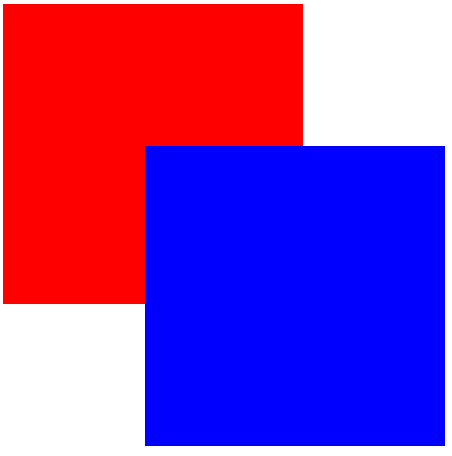

# 学习目标

>  理解定位的使用场景（一般用于解决盒子之间的层叠问题）
>
>  能够说出相对定位的特点
>
>  - 相对于自己原来的位置进行移动
>  - 占位置-》没有脱标
>
>  能够说出绝对定位的特点
>
>  - 默认相对于浏览器移动，如果有父元素，相对于有定位的父元素移动
>  - 不占位置-》脱标
>
>  能够说出固定定位的特点
>
>  - 永远相对于浏览器移动
>  - 不占位置-》脱标
>
>  能够理解子绝父相（子盒子绝对定位，父盒子相对定位，布局中会经常使用到）
>
>  能够实现z-index控制元素的层级（数值越大，层级越高）
>
>  能够说出vertical-align属性的使用（一般用于设置文本与行内块元素（图片）的垂直对齐方式）
>
>  能够说出三种隐藏元素的区别（**内容**超出隐藏、元素隐藏（**看不见**）、元素隐藏（**不存在**））
>
>  。。。。。。


**理解上课的知识点......**


# 定位

> 可以解决盒子与盒子之间的层叠问题

**问题：**现在在页面上有两个盒子，其中第二个盒子将第一个盒子压住了一半，怎么完成？？？



使用margin可以实现效果，但是并不好，定位可以专门解决这样的层叠问题

**初体验：**

`position：absolute；` 设置定位

**方位属性：**

> 水平和垂直方向各选一个使用即可，一般选取的原则是离那边近用哪个

- 水平方向：
  - left：相对于左边框的距离
  - right：相对于右边框的距离
- 垂直方向：
  - top：相对于上边框的距离
  - bottom：相对于下边框的距离

## static：静态定位（默认型）（有争议的）

> 标准流中的元素默认都是静态定位

**代码：** `position: static;` （默认值）静态定位

> 静态定位是有一定争议的（有些人认为静态定位不算定位）

**面试时候回答：**三种定位方式，优先回答其他三个（相对、绝对、固定），如果四种再写静态定位


## relative：相对定位（自恋型）

> 盒子相对于自己之前的位置定位移动（红绿蓝）

**代码：**`position: relative；` 相对定位

**特点：**

- 要配合方位属性使用，不然无法移动

- 相对于自己原来的位置进行偏移

- 设置了相对定位的元素在页面上占据了位置-》**没有脱标**

**应用场景：**

- 配合绝对定位组CP（子绝父相），用的最多
- 用于小范围的移动（比如让某个标签稍微往下移动几个像素）


## absolute：绝对定位（拼爹型）

> 绝对定位相对于非静态定位的父元素进行定位移动

**代码：**`position: absolute; ` 绝对定位


**特点：**

##### -----------------------------

- 需要配合方位属性移动使用


- **绝对定位相对谁移动**？？

  > 默认相对于浏览器进行移动，但是如果有父元素，则相对于有定位的父元素进行移动
  >
  > 判断方法：

  - 没有父元素-》相对于浏览器进行移动
  - 有父元素（判断父元素有没有定位（三种，非static））
    - 父元素没有定位-》相对于浏览器进行移动
    - 父元素有定位-》相对于有定位的父元素进行移动

- 绝对定位的元素在页面中不占位置-》**脱标**

**应用场景：**

- 子绝父相（子元素绝对定位、父元素相对定位），把子元素定位到父元素中的某个位置，用的最多！！！

  > 子绝父相这个CP不会影响页面的布局-》举例说明

##### ヾ(๑╹◡╹)ﾉ"子绝父相定位居中案例

> 如果小盒子在大盒子（1）水平居中（2）水平垂直都居中
>
> .father:600*400
>
> .son:200*100

- 先 left：50%， 将子盒子在父盒子向右平移父盒子的一半

- 再设置 margin-left：-（子盒子自身宽高的一半）

  注意：此时取值一定是负数-》 那么将来子盒子就可以水平居中了

- **优化：**但是此时子盒子大小变化时就不再居中了，margin-left：-50%也是相对父元素的不行；

  此时可以使用css3的新属性：`transform：translateX（-50%）沿着x轴的负方向移动自己的一半` 也能居中！

  

##### ヾ(๑╹◡╹)ﾉ"课堂练习：网站头部hot图标

##### ヾ(๑╹◡╹)ﾉ"课堂练习：小米商品页半透明效果

##### -----------------------------

## fixed：固定定位 （死心眼型）

> 盒子相对于浏览器进行定位移动

**代码：**`position: fixed; `  固定定位

**特点：**

- 配合方位属性一起使用

- 永远相对于浏览器进行移动
- 固定定位的元素也不在页面中占据位置-》**脱标**


> 注意的是：脱标后的元素和浮动脱标了一样，有类似于行内块元素的显示方式（宽度默认由内容撑开）

##### ヾ(๑╹◡╹)ﾉ"课堂练习：新浪网页


## 四种定位总结

|   是否脱标占有位置   |     定位模式     | 是否移动 |       移动位置基准       |
| :------------------: | :--------------: | :------: | :----------------------: |
|   不脱标，正常模式   |    静态static    |  不可以  |         正常模式         |
|   不脱标，占有位置   | 相对定位relative |   可以   |     相对自身位置移动     |
| 完全脱标，不占有位置 | 绝对定位absolute |   可以   | 相对于定位的父级移动位置 |
| 完全脱标，不占有位置 |  固定定位fixed   |   可以   |   相对于浏览器移动位置   |


# 元素的层级问题（z-index）

> 可以通过z-index设置页面中定位元素的层级关系，数值越大，层级越高

**取值：**整数

**注意：**

- 标准流、浮动、定位之间的层级关系

  > 两个盒子之间的比较

  ```
  三种层叠关系：
  标准流 < 浮动 < 定位（相对、绝对、固定）
  ```


- 定位之间的层叠问题：

  - 三者的层叠关系相同，写在下面元素的覆盖上面的

  - 可以手动设置定位元素的层级关系

    ```
    如果需要手动设置定位的层级关系，可以通过z-index属性设置层级
    z-index：数值;  数值越大  层级越高
    ```


# vertical-align（垂直对齐方式）

> 让图片（行内块元素）和文字对齐，需要优先给行内块元素设置垂直对齐方式

**问题：** 图片和文字在一行中显示的问题

```
如果文本与图片在同一行中显示，其实默认的效果是图片的底部和文字基线对齐的，此时就可能会影响页面的布局。
此时可以通过：
vertical-align: 可以设置文本与行内块（图片）的垂直对齐方式
```

**取值：**

- baseline：基线对齐
- top：顶部对齐
- middle：中线对齐
- bottom：底部对齐

**使用行内块元素可能会出现的bug：**

- 场景1 :  文本框（text）和表单按钮（button）无法对齐问题；
- 场景2 :  input 和 img无法对齐的问题；
- 场景3 : div里放一个文本框 ，此时文本框无法靠顶；
- 场景4：div有img标签撑开，此时img标签下方有间隙（给img标签设置vertical-align即可）；
- 场景5 : 使用line-height让img标签垂直居中，需要给img标签单独设置vertical-align：middle


**如果要让垂直布局的盒子变成水平布局，不推荐使用转换成行内块元素，推荐使用浮动完成效果。**

##### -----------------------------

# overflow：溢出

> 设置盒子内容超出盒子大小时的展示效果

**取值：**

```
visible  超出不裁剪（默认值）
hidden   如果盒子中的内容超出盒子范围，就隐藏
scroll   显示滚动条
auto     根据具体的情况，判断是否要添加滚动条（不超出没有，超出有）
```


# 元素的隐藏区别

> 隐藏元素的几种方式的区别（大小盒子嵌套）

## overflow:hidden；（超出隐藏）

> 隐藏超出部分

## visibility：hidden；（元素看不见）

> 隐藏元素，将元素看不见，但是在页面中还是占位置！！

## display：none；（元素不存在）

> 隐藏元素，将元素看不见，但是在页面中不占位置！！

```html
<div class="one">测试隐藏</div>
<div class="two"></div>
```


# html 标签的嵌套规范（了解）

> 块级元素一般用于布局：比如div在页面的布局用的最多；
>
> 行内元素一般用于放文字：比如span、a标签里面一般放文字
>
> 标签之间是不能随意嵌套的，书写的时候应该有对应的规范：

**注意点：**

- 行内元素一般放文字或者行内元素，但是**a标签之间不能互相嵌套**（会被浏览器解析成两个a标签）；
- 块级元素相当于一个容器，里面可以放文字、行内元素、块级元素，但是**p标签不能包含div标签**（p标签会被拆分成两个p标签）
- p标签作为一个段落标签，只有文字才会组成段落，所以p标签里面一般只放文字，不要放块级元素！！！


# 拓展

## 属性选择器

> 通过标签的属性，找到对应的标签
>
> 用的最多的情况是找到input标签的不同形态

```css
/* 找到页面中的文本框 */
input[ type = 'text' ] {
    css样式;
}

/* 找到页面中的普通按钮 */
input[ type = 'button' ] {
    css样式;
}

......
```


## 结构伪类选择器( -child系列)

> 如果现在想找到ul标签下面的第几个li标签的时候，除了使用class大法之外，还可以使用结构伪类选择器完成效果

- E:first-child          匹配父元素的第一个子元素E

      比如：li：first-child {css样式}
      查找过程如下：
      1、首先找到li 
      2、找li标签的父元素
      3、找父元素第一个子元素
      4、看这个子元素是不是li
      	1、是-》加样式
      	2、不是-》不加样式

- E:last-child           匹配父元素的最后一个子元素E

- E:nth-child(n)        匹配父元素的第n个子元素E

  ```
  针对于nth-child括号中可以写一个带n的式子，n的取值范围是0~正无穷的整数
  所以：
  1、找到所有的偶数：2n
  2、找到所有的奇数：2n-1 / 2n+1
  3、找到前12个：-n+12
  ```

