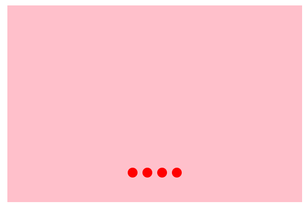
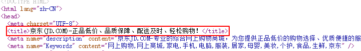
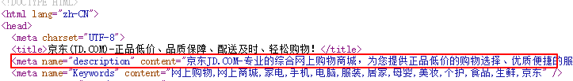
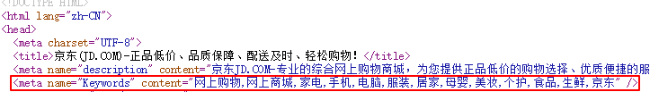

# 学习目标

> 能够使用ps进行基本的切图
>
> 能够完成项目基本目录搭建
>
> 能够完成品优购头部
>
> 能够完成品优购导航
>
> 能够设置盒子的边框圆角
>
> 。。。。。。


**理解上课的知识点......**


# 边框圆角

> 可以使用css画一个圆：border-radius（边框圆角）
>
> border：边框
>
> radius：半径



**取值：**

- 一个值：左上右上右下左下
- 两个值：左上右下、右上左下
- 三个值：左上、右上左下、右下
- 四个值：左上、右上、右下、左下

**记忆方法：** 先从左上开始赋值，顺时针赋值，如果没有赋值的，看对面的。

**常见的应用：**

- 画一个圆：
  - 盒子必须是一个正方形
  - border-radius：50%
- 胶囊按钮
  - 盒子是一个矩形
  - border-radius：盒子高度的一半


# 样式初始化的补充

>有时候会需要去除input默认的边框和textarea的自由缩放

**去除边框：**

- border：none

**去除input点击之后的边框轮廓线：**

- outline-style: none

**设置禁止textarea自由缩放：**

- resize：none


# 盒子宽高的百分比设置

> 如果需要一个父盒子中的四个子盒子，宽度为父盒子的四分之一，高度为父盒子的高度，怎么去完成？

- 可以直接设置数值（自己计算）
- 可以直接设置百分比（百分比相对于父盒子的宽高，让浏览器去计算）


# 项目搭建

> 每一个项目开始之前都要有项目的搭建。
>
> 对应有很多页面的大型的项目，因为每个页面都有自己对应的css文件，所以css文件需要单独放在一个css文件夹中

**项目搭建步骤：**

- 新建项目文件夹

- 新建images文件夹，把图片放在images文件夹中

- 新建css文件夹，把所有页面的css文件放入

  > 大型项目有多个页面，每个页面都有对应的css文件，为了项目的查阅方便，一般会把所有的css专门放在一个文件夹汇总

  - 新建index.css放入文件夹

- 新建页面index.html

**样式的初始化：**

- index.css中进行样式的初始化（把项目中要用的样式先写好）

  - 因为样式的初始化每个项目都是一样的，所有公司开发的时候会把样式初始化代码写成一个单独的**base.css**文件，开发的时候直接引入即可

    ##### ヾ(๑╹◡╹)ﾉ"查看base.css的代码

    > 问题：为什么要进行css初始化？请举例说明（考题）

    ```html
    <!-- 为什么要进行css初始化？ -->
    因为不同浏览器对于部分标签会不同的默认样式，开发的时候并不需要默认的样式。为了在不同浏览器中展示的效果是一样的，我们一般在项目开始的时候去除浏览器默认的样式即：css的初始化，需要的时候自己设置样式即可。
    
    <!-- 举例说明 -->
    
    1.清除标签的默认margin和padding：
    * {
        margin: 0; 
        padding: 0;
    }
    
    2.清除li标签之前的小点：
    ul{
        list-style: none;
    }
    
    3.清除a的下划线：
    a {
        text-decoration:none；
    }
    
    ......（base.css中有一堆）
    ```

- 在index.html中通过link标签引入index.css


## 页面ico图标的使用（了解）

> 较大的网站的title前面会有一个小的图标，这个小图标一般使用的就是ico图标

**使用步骤：**

- 获取`ico图标`
  - 一般是由UI设计师提供.ico图片
  - 可以通过 [一些转换网站](http://www.bitbug.net/) 将图片上传，获取ico图标

- 使用`ico图标`

  -   `<link rel="icon" href=" favicon.ico的路径">` 

    **一般将ico图标放到根目录下面**

## 页面seo三大标签（了解）

> 页面中有三个标签对于seo非常重要！

### title：标题标签

> 表示网页的标题，对于网页的seo权重很高！！



**一个大型的网页，也需要有对应的title标签的：**

```html
<title>38期品优购</title>
```


### Description：描述标签

> 是对于网页内容的描述，可以是对于标题的补充，一般文字不超过120个字。



**一个大型的网页，也需要有对应的description标签的：**

```html
<meta name="description" content="品优购-专业的综合网上购物商城,销售家电、数码通讯、电脑、家居百货、服装服饰、母婴、图书、食品等数万个品牌优质商品.便捷、诚信的服务，为您提供愉悦的网上购物体验!" />
```

### Keywords：关键字标签

> 是页面内容的关键字，对于seo也较为重要。



**一个大型的网页，也需要有对应的Keywords标签的：**

```html
<meta name="Keywords" content="网上购物,网上商城,手机,笔记本,电脑,MP3,CD,VCD,DV,相机,数码,配件,手表,存储卡,品优购" />
```

