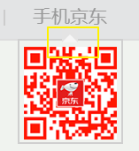
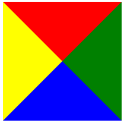

# 学习目标

> 能够完成品优购首页推荐模块
>
> 能够完成品优购首页焦点图模块
>
> 能够完成品优购首页楼层模块


**理解上课的知识点......**


# 使用css写出一个三角形

> 有时候需要在页面中展示一个三角形，并且要求只使用css代码，不用图片或者字体图标，怎么实现？

**例如：**



**可以通过边框来实现：**

- 设置一个盒子
- 设置四周不同颜色的边框
- 盒子的宽高设置为0




- 此时每一个方向的边框就是一个三角形了，选择一个之后让其他边框的颜色为全透明即可

  > 设置透明的方法

  - **rgba（0,0,0,0）**
  - **transparent**：表示全透明的颜色


**代码：**

```css
/* ------------------------------------方法一------------------------------------ */
div {
    width: 0;
    height: 0;
    border-left: 100px solid purple;
    border-bottom: 100px solid transparent;
    border-right: 100px solid transparent;
    border-top: 100px solid transparent;
}
/* -----------------------------------方法二--------------------------------------- */
div {
    width: 0px;
    height: 0px;
    border-width: 100px;
    border-style: solid;
    border-color: transparent transparent transparent purple;
}
```


# 三种鼠标常见的样式

> 通过cursor属性来设置鼠标移入盒子中的样式

取值：

- **default** ：光标为一个箭头（默认样式） 
- **pointer** ：光标为一只小手（a标签的默认样式）
- **text** ：此光标指示文本 